<p align="center">
  
</p>

A Python simulation and analysis of the classical **Secretary Problem** (also known as the Optimal Stopping Problem), exploring the famous `n/e` threshold strategy through both Monte Carlo simulation and theoretical derivation.

---

## What is the Secretary Problem?

You are interviewing `n` candidates one by one. After each interview, you must immediately decide to hire or reject — no going back. What strategy maximizes your probability of hiring the **best** candidate?

The classical answer: **observe the first `r = n/e ≈ 37%` candidates without hiring anyone, then hire the first candidate who is better than all of those.**

This gives a success probability that converges to `1/e ≈ 36.8%` as `n → ∞`.

---

## Project Structure

```
.
├── StoppingSecProblem.py        # Core simulation + plotting
├── convergence_verification.py  # Convergence analysis across different n
└── README.md
```

### `StoppingSecProblem.py`
- `helper(n, r)` — Simulates a single run of the secretary problem
- `simulate_secretary(n, r, trials)` — Monte Carlo simulation over many trials
- `theoretical_probability(n, r)` — Exact theoretical probability for a given threshold `r`
- `empirical_curve(n, trials)` — Full empirical probability curve across all `r`
- `theoretical_curve(n)` — Full theoretical curve across all `r`
- `plot_secretary_problem(n, trials)` — Plots empirical vs theoretical curves with the `n/e` optimal threshold marked

### `convergence_verification.py`
- `test(n)` — Finds the empirically best threshold `r` for a given `n`
- `simulation()` — Runs analysis across multiple values of `n` and compares the empirical best `r` against `n/e`

---

## How to Run

**Requirements:** Python 3.x, `matplotlib`

```bash
pip install matplotlib
```

**Plot empirical vs theoretical curves for n=100:**
```python
# In StoppingSecProblem.py, uncomment the last line:
plot_secretary_problem(100, 10000)
```

**Run convergence verification:**
```bash
python convergence_verification.py
```

Sample output:
```
n        best r     n/e        max probability
10        3          3.67       0.398
50        18         18.39      0.364
100       37         36.78      0.368
1000      368        367.87     0.368
```

---

## Key Results

| Concept | Value |
|---|---|
| Optimal threshold | `r* = n/e` |
| Asymptotic success probability | `1/e ≈ 36.8%` |
| Strategy | Skip first `r*` candidates, hire the next best |

---

## Status

🚧 **Work in progress** — updated regularly.

Planned additions:
- [ ] Extensions (multiple offers, partial information, fuzzy rankings)
- [ ] Alternative optimal stopping problems
- [ ] Interactive visualizations
- [ ] Mathematical derivation writeup

---

## References

- Ferguson, T.S. (1989). *Who solved the secretary problem?*
- [Wikipedia — Secretary Problem](https://en.wikipedia.org/wiki/Secretary_problem)

---

<p align="center">
  
</p>
